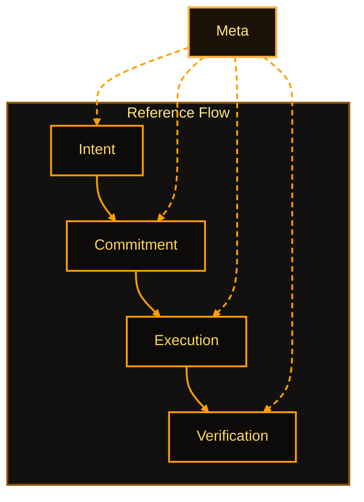
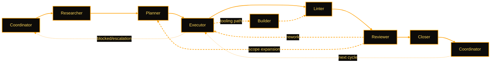

<!-- markdownlint-disable MD013 MD025 -->

# ai_ops: Design and Philosophy

## Purpose

Consolidated design philosophy and principles for ai_ops. Covers the central bet, axis systems, the Crew Model
(lanes, riders, profiles, model tiers), verification approach, and design tests. Human-audience orientation
document; for AI agent bootstrapping see AGENTS.md.

## Why ai_ops exists

The first week with AI on a real project feels like magic. An agent
drafts the plan, writes the code, names the folders, generates the
docs. It is fast -- almost suspiciously fast.

Then the project gets real.

A teammate joins midstream. You switch models. The conversation thread
fragments. The scope changes quietly in the middle of a "small tweak."
Someone asks for a status update and you realize you cannot answer
without scrolling through pages of chat, hoping you notice the moment
when an assumption became a decision.

The magic did not disappear. It ran into an old problem: collaboration
is an engineered system whether you admit it or not.

ai_ops is the admission.

It is not a prompt library. It is not a tool-specific framework. It is
not a productivity app. It is a governance layer designed for one thing:

In systems terms, ai_ops functions as an AI development orchestration layer
and an AI engineering operations platform for governed human-AI delivery.

> **Make human-AI collaboration reliable at scale.**

Not perfect. Not smart. Not anthropomorphic. Reliable.

Reliable means you can restart work tomorrow, or next month, or with a
different model, or with a human stepping in mid-run -- and the work
state is recoverable from files alone.

---

## The central bet: artifacts are the system

Most AI workflows are built around a simple idea: keep everything in
the conversation. The plan lives there. The decisions live there. The
definition of done lives there.

But chat is a bad system of record. It cannot be diffed cleanly. It
does not survive handoffs. It rewards doing important work in an
undocumented place because it is convenient.

ai_ops makes a different bet:

> **Work state belongs in the repository, not in the conversation.**

Conversation is UI. Artifacts are the system.

> **If it matters tomorrow, it must exist as a file today.**

This one shift changes everything. A new teammate or a new agent can
land in the repository and proceed without reading the entire chat
history. Progress survives interruptions and model swaps. "What
happened" becomes something you can audit instead of something you
have to remember.

---

## Speed you can trust

AI makes output cheap. That is its superpower and its trap. When it is
easy to generate ten versions of something, teams start treating motion
as progress. Speed without boundaries becomes drift.

Most teams choose one: move fast and accept drift, or control drift and
accept slowness.

ai_ops refuses the trade. It delivers both through structure:

- **Authority-aware gates** so risky work slows down only when it must
- **Artifact-first context** so agents do not re-invent the task each turn
- **Built-in verification loops** so "done" actually means something

The goal is not bureaucracy. The goal is **speed you can trust**.

---

## Two axis systems

ai_ops organizes everything by two complementary systems that govern
where artifacts live and whether they are good.

### Organizing axes: where things belong

> **Intent -> Commitment -> Execution -> Verification** (+ Meta)

This is not branding. It is a placement rule. Each artifact must have
a primary job:

- **Intent**: what outcome do we want? *(workflows)*
- **Commitment**: what scope is locked for this run? *(workbooks, spines)*
- **Execution**: how do we carry it out? *(runbooks, pipelines, tools)*
- **Verification**: how do we prove it is correct and safe? *(contracts, validators)*
- **Meta**: how does the system work, and who can change it? *(policies, guides, specs)*

| Axis | Purpose | Primary Artifacts |
| --- | --- | --- |
| Intent | Describe desired outcomes and strategies | Workflows |
| Commitment | Freeze approved scope for execution | Workbooks, Execution Spines, Workprograms |
| Execution | Define how work is carried out | Runbooks, Pipelines, Tools, Modules |
| Verification | Define correctness and safety gates | Contracts, Validators, Logs |
| Meta | Explain and govern the system | Policies, Guides, Specs, Vocabulary, Catalogs |

The core constraint:

> **Mixed responsibility is drift.**

When one artifact tries to do two axis jobs, it becomes harder to
resume, harder to validate, and easier to argue about. Cross-references
are allowed. Mixed responsibility is not.

### Quality axes: whether things are good

Every artifact and operation is reviewed through four lenses:

| Axis | Purpose | Interpretation | Scope | Quick-Scan Check |
| --- | --- | --- | --- | --- |
| **Clarity** | Cold-start readability | No inference required; inputs/steps/outputs explicit | Local | Can a new reader follow without external context? |
| **Thrift** | Efficient required outcome | Minimum cost to achieve result; includes execution burden, read hops, and retracing | Local + Global | Is each element necessary? Are there avoidable bounces? |
| **Context** | Reliable resumption/handoff | Work restarts from files; handoff state explicit | Global | Can a different agent resume from artifacts alone? |
| **Governance** | Authority and gate discipline | Authority boundaries explicit, traced, and enforced | Global | Are decision gates in the right place? Is authority clear? |

One subtle point defines the culture:

> **Thrift is not minimalism. Thrift is efficiency.**

A shorter document that forces five extra hops across the repo is not
thrifty. Thrift includes internal cycle burden: rereads, backtracking,
and missing routing that slow cold-start execution or review.

---

## Authority: explicit, not assumed

ai_ops treats authority as a first-class system constraint. Authority
is not inferred. Authority is not implied. Authority is explicit.

| Level | Scope | Action |
| --- | --- | --- |
| 0 | Read, analyze, report | Always allowed |
| 1 | Single atomic edit | Pre-authorized if in scope |
| 2 | 2-5 related changes | Confirm first |
| 3 | 6+ changes or multi-layer | Create workbook, wait for approval |
| 4 | Policies, specs, architecture | Document rationale, require human approval |

This lets you do two things at once: move fast on low-risk work, and
force structure on high-impact work.

> **Gates must exist where harm is plausible.**

This is why quick refactors stay atomic, why policy changes require
explicit approval, and why broad change lists require structured
execution.

---

## Artifact families

ai_ops uses two related artifact families because planning and doing
are not the same activity.

### Work-family: governed intent and commitment

A typical progression:

- **Workprogram** coordinates multiple workbundles (portfolio level)
- **Execution Spine** provides canonical sequencing and gates
- **Workbundle** groups a workbook with companion artifacts
- **Workbook** is the committed plan (frozen after approval)

This family answers: what are we trying to accomplish, what is
committed for this run, what gates must pass, and what evidence
proves it?

### Run-family: reusable execution

- **Runprogram** orchestrates multiple runbundles (reusable)
- **Runbundle** groups runbooks for a scenario
- **Runbook** is the reusable "how-to" procedure
- **Tools / Pipelines** execute steps
- **Validators** enforce contracts

This family answers: how do we do it repeatably, what steps are stable
across projects, and what tools execute them?

### The relationship

A workbook binds to runbooks by reference. A spine binds to gates and
to who owns the next step. Runbooks bind to tools and validators.

This prevents two failure modes: tool lock inside intent (workflows
hardcode execution) and commitment leak into reuse (runbooks become
project-specific).

---

## The Crew Model

The **Crew Model** is ai_ops's umbrella for how agents are configured and coordinated:
canonical lanes, behavioral archetypes (riders), named profiles, and model tier
assignments -- whether a single agent switches lanes sequentially, or a primary agent
orchestrates dedicated subagents. Governance outcomes are the same either way.

The key design separation:

- **Governance** is the stable layer: authority, scope gates, artifacts, validation.
- **Behavior** is a configurable layer: how agents think, decide, and report.

Behavioral customization -- profiles, slider adjustments, communication style -- is
opt-in through `/profiles`. It sits on top of governance, not inside it.

### Canonical orchestration lanes

Lane sequence flows left to right. Coordinator repeats at each cycle boundary.
Builder is invoked as needed for tooling work. Not every run activates every
lane; the default single-agent baseline is `Coordinator -> Executor -> Reviewer`.

| Lane | When Active | Primary Duties | Reasoning Level | Notes |
| --- | --- | --- | --- | --- |
| Coordinator | Start, phase boundaries, escalation points, end | Scope, approvals, orchestration, handoffs | 2 | Level 3: architectural decisions; Level 4: policy authorship |
| Planner | When scope must be converted into executable steps | Turn approved scope into phased task contracts and sequencing | 2 | Level 3: architecture-heavy planning; Level 4: system-level design |
| Researcher | Discovery-heavy phases | Gather evidence, map current state, surface options | 1 | Level 2: synthesis-heavy or multi-authority discovery |
| Executor | Per work step | Execute current step, maintain logs, flag blockers | 2 | Level 1: fully deterministic tasks (optimize down) |
| Builder | When tooling/config work is needed | Write tools, implement automation, update configs | 2 | Level 1: routine tasks (optimize down); Level 3: policy-boundary tooling |
| Linter | When mechanical validation is needed | Run validators and report defects with evidence | 1 | No variation — Level 1 always |
| Reviewer | After meaningful execution phases | Judge correctness, governance fit, and adequacy of decisions | 2 | Level 3: Elevated Crosscheck; Level 4: L4 crosscheck |
| Closer | Finalization and release-ready closeout | Sweep completion state, sync approvals, finalize handoff | 2 | No variation — Level 2 always |

- **Single agent:** one agent sequences through all activated lanes in its own context.
- **Multi-agent:** Coordinator delegates only bounded lane work with explicit
  topology/delegation contracts.

**Topology vs Lane:** A *topology* defines the structural arrangement of execution
(how many agents, how connected, what surface). A *lane* defines the behavioral
contract for a type of work. A topology uses lanes; a lane is not a topology.
See `AGENTS.md §Topology and Lane Concepts` for the canonical definition.

**Director topology (design note, not yet implemented):** A Director pattern
allows one primary session to spawn Coordinator subagents per project for
concurrent work streams. Implementation deferred -- requires a Coordinator
native agent file with the `Agent` tool. See `AGENTS.md §Topology and Lane Concepts`.

### Riders: behavioral archetypes

A rider is a behavioral archetype -- a named preset that shapes how the agent approaches work
(caution, initiative, judgment style) without changing lane authority or permissions. Riders
are **operator-selected** and **lane-agnostic**: the same rider applies regardless of which
lane is active. Riders only come into play when the operator selects a profile via `/profiles`.

| Rider | Characteristic |
| --- | --- |
| logike | Methodical, structured -- planning and scoping focus |
| forge | Action-oriented -- execution, build, and delivery focus |
| anchor | Conservative, thorough -- review, gate, and correctness focus |
| scout | Curious, exploratory -- research and discovery focus |

### Profiles: named behavioral contracts

A profile is a **behavioral contract** expressed in natural language. Each profile packages
a rider archetype with specific parameter sliders (autonomy, conservatism, initiative,
deference) and technical config (permission mode, max turns). Profiles are generated from
source data so changes are repeatable, diffable, and auditable. The profiles themselves are
portable -- a logike-based profile works as a planner or a reviewer.

| Profile | Rider | Autonomy | Conservatism | Initiative | Deference | Permission Mode | Max Turns |
| --- | --- | --- | --- | --- | --- | --- | --- |
| ai-ops-planner | logike | 55 | 75 | 30 | 60 | plan | 20 |
| ai-ops-executor | forge | 75 | 45 | 45 | 45 | default | 30 |
| ai-ops-builder | forge | 75 | 60 | 35 | 45 | default | 30 |
| ai-ops-reviewer | anchor | 25 | 90 | 20 | 80 | plan | 10 |
| ai-ops-researcher | scout | 70 | 60 | 70 | 55 | plan | 30 |
| ai-ops-closer | forge | 75 | 80 | 20 | 45 | default | 30 |
| ai-ops-linter | anchor | 70 | 90 | 20 | 80 | default | 30 |

| Profile | Typical Canonical Lane |
| --- | --- |
| ai-ops-planner | Planner |
| ai-ops-executor | Executor, Builder |
| ai-ops-builder | Builder |
| ai-ops-reviewer | Reviewer |
| ai-ops-researcher | Researcher |
| ai-ops-closer | Closer |
| ai-ops-linter | Linter |

For parameter glossary and source contracts, see `02_Modules/01_agent_profiles/`.

**Relational sliders** (Communication Depth, Tone Warmth, Formality, Directness)
apply to the **primary agent / Coordinator profile only** -- subagents return
structured output to the primary agent and do not communicate directly with
humans. These are separate from the professional sliders in the profile table above.

### Model tiers

Model level refers to LLM reasoning depth -- not authority level (0-4).

| Level | Depth | Typical Tasks | Default Lanes |
| --- | --- | --- | --- |
| 1 | Low | Bounded extraction, formatting, simple edits | Researcher (bounded discovery), Executor (bounded execution), Linter |
| 2 | Medium | Scoped implementation, multi-step work | Coordinator (standard), Planner, Executor, Builder, Reviewer, Closer |
| 3 | High | Architecture, governance, precedent-setting | Coordinator (L4 decisions), Planner (architecture-heavy), Reviewer (Elevated Crosscheck) |
| 4 | Maximum | Policy authorship, canonical specification, L4 crosscheck | Coordinator (policy decisions), Reviewer (L4 crosscheck), Planner (system-level design) |

Default to Level 2 when unsure. Model level is set per workbook via `model_profile`
(level-name: `low`/`medium`/`high`/`maximum`). `activated_lanes` declares canonical
lane participation. See `AGENTS.md §AI Model Level Reference` for per-lane escalation
conditions.

Operators may declare a **model-ID-to-level binding** in `.ai_ops/local/config.yaml`
under `customizations.model_capabilities.model_level_map` (populated via `/customize`).
This binding resolves workbook level references to concrete model IDs at runtime.

### Subagents: specialization without fragmentation

When a platform supports delegation, ai_ops uses runtime-local subagent
presets derived from the canonical lanes. Each preset has two pieces:

1. **Structural guardrails** (frontmatter): what tools it can use,
   whether it can write, turn limits.
2. **Behavioral contract** (body prose): generated from the profile.

You can tune behavior without accidentally changing mechanical
permissions.

In multi-agent mode, every delegated worker returns to the primary agent in a
uniform structured format. The primary agent then communicates with the
human using its own relational style. This creates a clean split:
machine-optimized returns between agents, human-optimized delivery
to the user.

### Graceful degradation: single-agent mode

Not every environment supports subagents. ai_ops is designed so governance
outcomes are the same even when delegation is unavailable. A single agent
performs internal lane switching, usually along the minimum path
`Coordinator -> Executor -> Reviewer`, and activates additional lanes only
when the work shape requires them. The artifact model is unchanged.

Multi-agent orchestration is an optimization, not a dependency.

### Complement native tools, do not compete

Different AI platforms ship their own native commands. ai_ops does not
try to duplicate them.

Native commands manage the **agent session** (context, model,
permissions). ai_ops commands manage the **governed work lifecycle**
(scope, authority, verification, artifact management). When overlap
exists, ai_ops is explicit about the distinction.

---

## Platform portability

ai_ops is designed to preserve governance outcomes across different agent
runtimes rather than binding to one orchestration model.

- **Multi-agent mode:** Subagents are specialized by lane, with structural
  controls and profile-generated behavior contracts.
- **Single-agent mode:** The same lane contracts are applied via internal lane
  switching; delegation is removed, not redefined.
- **Adapter boundary:** Platform-specific command or file wiring is handled
  by adapters. Workflow intent and validation logic remain repository-owned.
- **Graceful degradation rule:** If a platform capability is missing, ai_ops
  falls back to the nearest governed equivalent instead of silently skipping
  governance requirements.

This portability model protects consistency for humans and agents who move
between Claude Code, Codex, Gemini, or future runtimes.

---

## Verification: built in, not bolted on

Verification is not a final step. It is woven into the workflow:

- `/work` includes selfcheck loops at phase boundaries
- `/crosscheck` provides structured independent review
- `/closeout` runs configured validators before committing
- `/health` audits repository structural integrity
- Contracts define machine-enforceable checks (binary pass/fail)

The pattern is: plan -> execute -> verify -> report.

A critical nuance: **crosscheck requires independence.** A selfcheck
in the same conversation is structural compliance only. Genuine
crosscheck means a different agent, or at minimum a separate
conversation thread reading only the artifacts. Same-thread self-review
is recognized as weaker and should be treated as structural validation,
not independent judgment.

---

## Context handoff

In ai_ops, handoff is not a paragraph. It is a payload.

Compacted context is the minimum, structured state needed to resume:
what changed, what exists now (paths), what is next, what blocks, and
how to validate.

This is how the system scales: from one agent to many, from one session
to many, from one repo to governed external repos.

---

## Governed mode: portable governance

ai_ops can govern execution in another repo without copying its
internals. The governance lives here. The work happens there. This
keeps one canonical authority model, one canonical workflow contract,
one vocabulary -- and still lets the target repo remain itself.

---

## Benefits and the benefit of the benefit

ai_ops is not structure for structure's sake. It delivers benefits
that compound:

- **Benefit:** Work becomes restartable.
  **Benefit of the benefit:** Teams stop paying the re-onboarding tax.
- **Benefit:** Decisions become auditable.
  **Benefit of the benefit:** Disagreements become resolvable without
  politics.
- **Benefit:** Validation becomes explicit.
  **Benefit of the benefit:** Trust increases, so speed increases.
- **Benefit:** Roles and gates become clear.
  **Benefit of the benefit:** Risk is contained without slowing
  everything.

The compound effect is the real product:

> **More output per unit of attention, without losing control.**

---

## What ai_ops is not

ai_ops is easiest to understand by what it refuses to become:

- **Not a prompt library.** Prompts change; governance persists.
- **Not a model zoo.** Models are replaceable; artifacts and contracts
  are not.
- **Not a mega-doc.** One giant document is not operational state.
- **Not a chat transcript system.** Chat is UI; evidence lives in
  artifacts.
- **Not a tool-specific framework.** Tools are swappable; workflows
  are portable.
- **Not bureaucracy.** Governance is minimal by default and escalates
  only with risk.

---

## Design tests

ai_ops applies eight named design tests when proposing any new artifact or process:
Axis, Cold-start, Restart, Gate, Thrift, Adapter, Independence, and Portability.

For the canonical descriptions of each test, see
[guide_design_tests.md](../ai_operations/guide_design_tests.md).

---

## Anti-patterns

These are predictable failure modes that ai_ops is designed to prevent:

- **The Chat-Only Plan**: nothing durable; everyone re-invents context.
- **The Big Doc**: one mega-file that becomes unreviewable.
- **The Over-Split Doc**: too many fragments; execution requires
  bouncing.
- **The Implicit Gate**: "it seems fine" replaces validation.
- **The Tool Lock**: workflows hardcode commands; portability breaks.
- **The Perma-Draft**: artifacts never become commitments; nothing
  ships.
- **The Echo Review**: same agent reviews its own work in the same
  context; finds nothing new.

---

## Quick reference

### Commands

| Command | Use it when | What it does |
| --- | --- | --- |
| `/work` | Starting or resuming work | Establishes context and execution path |
| `/work_status` | Need current state | Summarizes active work and blockers |
| `/work_savepoint` | Stopping mid-task | Commits + pushes savepoint, then ends session |
| `/closeout` | Work is complete | Runs validation and closeout workflow |
| `/crosscheck` | Need review feedback | Runs structured review workflow |
| `/health` | Repo seems inconsistent | Runs report-only health analysis |
| `/harvest` | Artifacts need cleanup | Consolidates and prunes work artifacts |
| `/bootstrap` | Context feels wrong | Re-reads context and readiness inputs |
| `/scratchpad` | Need structured notes | Creates or updates scratchpad notes |
| `/customize` | Preferences need updates | Applies configuration workflow |

### Start here

| You are | Start with |
| --- | --- |
| A human | [HUMANS.md](../../../HUMANS.md) |
| An AI agent | [AGENTS.md](../../../AGENTS.md) |
| A contributor | [CONTRIBUTING.md](../../../CONTRIBUTING.md) |

### Axes at a glance

- Organizing: Intent -> Commitment -> Execution -> Verification (+ Meta)
- Quality: Clarity x Thrift x Context x Governance

### Vocabulary anchors

- **Workflow** (Intent): reusable intent recipe
- **Runbook** (Execution): reusable procedure
- **Workbook** (Commitment): single-run plan, immutable after approval
- **Workbundle**: folder grouping workbook + companions
- **Workprogram**: multi-workbook coordination
- **Execution Spine**: canonical sequencing + gates
- **Contract**: spec with machine-enforced checks
- **Validator**: checker that enforces contracts
- **Scratchpad**: transient companion notes

### Design heuristics

- If the artifact is reusable -> workflow or runbook
- If it locks scope for one run -> workbook
- If it sequences multiple books -> needs a spine
- If it claims correctness -> needs contracts + validators
- If it helps execution but should not outlive the run -> scratchpad
- If it describes behavior for an AI agent -> agent profile
