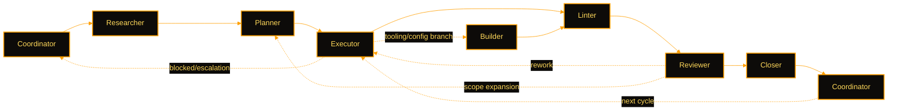
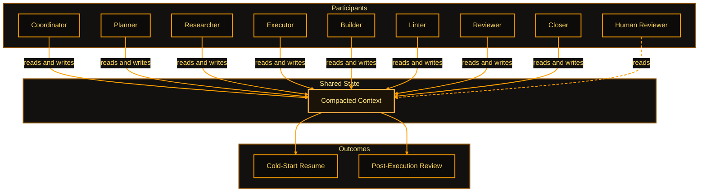

<!-- markdownlint-disable MD013 MD025 -->

# Agents: Start Here

## Quick Path (Read This First)

**On first turn:** Read this file. This is the canonical bootstrap entry point.
Read `CONTRIBUTING.md` on demand for contributor policy, maintainer workflow,
or unresolved authority ambiguity.

**Mode check:** Determine whether you are operating ai_ops directly (ai_ops repo
is your target) or governing an external repo (ai_ops is your ops stack; the
target is a separate work repo). This is your most important first classification.
See Mode Detection section for the full decision table.

**Do not** scan the filesystem or infer repo purpose before completing bootstrap.

---

## Authority Quick Reference

| Level | Scope | Action |
| ----- | ----------------------------- | ------------------------------------------ |
| 0 | Read, analyze, report | Always allowed |
| 1 | Single atomic edit | Pre-authorized if in scope |
| 2 | 2-5 related changes | Confirm first |
| 3 | 6+ changes or multi-layer | Create workbook, wait for approval |
| 4 | Policies, specs, architecture | Document rationale, require human approval |

Full authority execution contract is consolidated in this document.

**Key principle:** Authority is explicit, not assumed. If uncertain, ask.

**Safe default:** If you are unsure of authority, treat it as Level 3 and ask.

### Authority Detail

Use these details when classifying non-obvious requests:

- **Level 0**: read, analyze, report only (including review reports in active
  workbundle or sandbox).
- **Level 1**: one atomic edit in explicit scope, plus obvious hygiene fixes
  (links, lint, terminology, repo structure map update).
- **Level 2**: 2-5 related edits in one scope (including simple renames and
  linked reference updates); confirm first with the requestor.
- **Level 3**: 6+ edits, multi-layer change, or multi-step resumable lane;
  includes structural reorganization and analysis that yields prioritized
  action lists; create workbook and wait for approval.
- **Level 4**: policy/spec/architecture touching scope; require explicit human
  approval with rationale before execution.

### Path-Based Authority Guard (Pre-Write)

Before any file write, classify the target path against this guard:

| Path Pattern | Minimum Authority | Required Behavior |
| --- | --- | --- |
| `00_Admin/{policies,specs}/**`, `AGENTS.md`, `CONTRIBUTING.md`, `HUMANS.md` | Level 4 | Stop; require explicit human approval. |
| `.ai_ops/workflows/**` | Level 4 | Stop; require explicit approval evidence before edits. |
| `00_Admin/configs/**` | Level 4 | Stop; require explicit human approval. |
| `00_Admin/guides/**` | Level 3 | Use approved workbook scope; do not direct-edit outside scope. |
| `90_Sandbox/**` | Level 1-2 | Allowed when in-scope and request-aligned. |
| `.ai_ops/local/**` | Level 1 | Machine-local work state; update freely when directed by /work or /closeout. Never commit. |

If a path does not match, default to higher governance and ask.

## Agent Decision Tree

```text
START: Work identified

Is this reading/analysis only?
 YES -> Proceed (Level 0)
 NO  ->

Is this single atomic edit in pre-authorized path?
 YES -> Proceed, document (Level 1)
 NO  ->

Is this 2-5 related changes, same scope?
 YES -> Confirm first (Level 2)
 NO  ->

Is this 6+ changes OR multi-layer?
 YES -> Create workbook (Level 3)
 NO  ->

Does this affect policies/specs/architecture?
 YES -> Document rationale, wait (Level 4)
```

## First-Turn Guardrails

- Do not scan the filesystem before reading this file.
- Do not infer repo purpose from directory names.
- Only perform wide scans when explicitly requested.
- If you started scanning before bootstrap, stop, note the violation, and restart.
- Mid-session rebootstrap: re-read this file (Quick Path only).
- Treat questions as questions: answer first. Do not execute edits unless the
  user explicitly asks for action.
- A question about what should change is not authorization to change it.

---

## Red Flags Requiring Workbook

If a response implies multi-phase execution, broad remediation, or workbook-
sized scope, stop and apply this Red Flags gate.

Terminology guardrail: use **work proposal** (not "implementation plan") for Level 4 governance changes.

Common red flags:

- "Here are commands/scripts to run..."
- "I can implement these fixes quickly..."
- "Phase 1 / Phase 2 / Phase 3..."
- "I found N issues, here is a broad fix list..." (especially N > 5)
- "Analysis suggests a prioritized remediation list..."
- Changes span 3+ directories or can fail partway and require resumption
- You expect a status checkpoint question ("what is the status?") before finish

---

## Self-Check Before Acting

Before proposing actions, verify:

- [ ] I identified the authority level (0-4).
- [ ] I followed the decision tree.
- [ ] If Level 3+, I am proposing workbook execution, not direct edits.
- [ ] If Level 4, I documented rationale and am waiting for explicit approval.
- [ ] I am not presenting multi-step implementation as ad-hoc "quick wins".
- [ ] I am not prescribing command sequences for workbook-sized work.
- [ ] If L2+, I emitted a `policy_decision:` PDR (see `00_Admin/specs/spec_policy_decision_record.md`).

## Response Thrift

Keep outputs efficient without sacrificing correctness:

- Be concise by default; expand when complex or requested
- Prefer pointers to canonical docs over recreating content
- Optimize for clarity and actionability
- Do not increase internal cycle burden in touched docs without explicit
  justification and landing-zone mapping
- Quantitative cost governance (token budgets, model routing): `00_Admin/specs/spec_cost_governance.md`

## Thriftiness Pass

If `customizations.review_preferences.thrift_pass` is enabled in
`.ai_ops/local/config.yaml`:

- `local`: limit to files touched in current execution
- `meta`: broad refactors; log in workbundle scratchpad before proposing a
  dedicated workbook

## Selfcheck Loop (Completion Gate)

Before reporting "done" on any workbook or multi-step task, run a selfcheck loop:

```text
LOOP until (clean OR blocked OR iterations >= 3):
  1. Re-read all tasks from beginning
  2. For each task, verify: completed? outputs exist? no regressions?
  3. Run thrift/streamlining pass on touched docs:
     - no unnecessary duplication
     - no dead references
     - no avoidable cross-document hop increases
  4. If gaps found -> fix and increment iteration
  5. If blocked -> record blocker and exit loop
  6. If clean -> exit loop
END LOOP
```

**Exit conditions:**

- **Clean:** All tasks verified, no gaps. Report completion.
- **Blocked:** Issue cannot be resolved without user input. Report blocker.
- **Max iterations (3):** Persistent issues remain. Report partial completion with remaining gaps.

**Never report "done" after a single pass.** The first pass often misses edge cases.

**Circuit Breakers:** Self-interrupt conditions for unattended execution (token budget exceeded,
scope creep, authority escalation, stale context, consecutive tool failures): PARK and emit PDR.
See `00_Admin/specs/spec_governance_lifecycle.md`.

---

## Approval Scope Rule

When a Work Proposal, Workbook, or Phase is approved, that approval authorizes
all actions within approved scope. If scope changes, stop and ask.

Workbook creation approval does not authorize workbook execution. Treat these
as separate gates.

When an L3/L4 gate is reached and the operator is not synchronously present, use the
async approval contract (PARK): save context, emit REQUIRE_APPROVAL PDR, resume when
approved. See `00_Admin/specs/spec_async_approval_contract.md`.

## Pre-Authorized Actions

Agents may perform without extra confirmation when scope permits:

- read anywhere
- write in `90_Sandbox/**`
- update `<git_root>/repo_structure.txt`
- edit files explicitly in approved workbook/workbundle scope
- update `.ai_ops/local/work_state.yaml` when directed by /work, /closeout, or approved workbook scope
- auto-fix YAML, links, lint, and terminology drift

If uncertain, ask before writing.

Pre-authorized logs:

- Update `00_Admin/logs/log_workbook_run.md` and workbook/workbundle logs when
  required by active execution artifacts.

## Commit/Push Gate

Before commit/push for Level 3+ work:

1. Provide change summary (files touched, key edits, validation results).
2. Obtain explicit requestor approval.
3. Record approval in `00_Admin/logs/log_workbook_run.md`.

Level 2 changes should also use this gate when scope is non-trivial or the
requestor asks for explicit review before commit/push.

## Request Clarification Gate

If a request is vague, ask for:

- desired outcome and deliverable
- scope boundaries (in/out)
- target artifact type
- constraints
- success criteria

If scope expands during execution, stop and reclassify authority.

---

## Decision Matrix Hooks

Use decision aids in this order to avoid unnecessary rereads or duplicate
branching logic:

1. `Agent Decision Tree` in this file:
   authority classification and workbook-threshold check.
2. `Mode Detection` in this file:
   direct vs governed vs standalone repo context.
3. `00_Admin/guides/ai_operations/guide_workflows.md`:
   canonical artifact-selection and execution-context matrices.
4. Workflow-local matrix blocks in `.ai_ops/workflows/*.md`:
   only when the selected workflow has command-specific branching or local
   deltas not already covered upstream.

Rule:

- Prefer the upstream matrix family unless the active workflow truly differs.
- Do not duplicate full upstream decision trees into every workflow.

---

## Mode Detection

| Target | Mode | Logic |
| --------------- | -------------- | ------------------------------------------------------------------------- |
| ai_ops itself | **Direct** | `AGENTS.md` is in the root of the repo you are directly operating. |
| External repo | **Governed** | ai_ops is an external ops stack; workspace topology names a target repo. |
| No ai_ops found | **Standalone** | No `AGENTS.md` with ai_ops structure can be resolved. |

**Rule:** Determine target repo root first, then resolve mode from workspace
topology (see Workspace Topology section below).

Fallback if manifest is missing/conflicting:

1. Prefer `ai_ops` governance files when available.
2. Follow `AGENTS.md` as minimum bootstrap baseline; load `CONTRIBUTING.md`
   when contributor policy details are required.
3. Pause and ask if mode/scope is still ambiguous.

Minimum governed-mode verification snippet:

- confirm target repo root and active artifact path
- confirm validator/lint command path for target repo
- confirm sandbox destination and no cross-repo write drift

---

## Level 0-2 Early Exit

If you are recentering mid-session or doing Level 0-2 work:

1. Re-read this file (Quick Path section).
2. Read `.ai_ops/local/work_state.yaml` for active work context (`work_context.active_artifacts`).
   Absence = no active work; not an error. If different than expected, notify requestor.
3. If authority remains Level 0-2 and no workbook red flags are triggered, stop here and proceed.

**Early Exit Marker (Level 0-2):** You may stop at this section for Level 0-2
execution. Continue to "Bootstrap Sequence (Full)" only for Level 3+ work.

Full bootstrap (reading policies, specs, guides) is only required for Level 3+ work.

**Active Artifacts Authority:** `.ai_ops/local/work_state.yaml` is the single source of truth for
`active_artifacts`. This file is machine-local and gitignored; absence means no active work.
Governed repos do not mirror this section. See `work_context.updated_at` timestamp for freshness.

---

## Axes At A Glance

ai_ops uses two axis groups. Keep both visible while choosing artifacts and reporting status.

- Organizing axes: `Intent -> Commitment -> Execution -> Verification` (+ Meta governance)
- Quality axes: `Clarity`, `Thrift`, `Context`, `Governance`

Canonical definition:
`00_Admin/guides/ai_operations/guide_ai_operations_stack.md`

### Organizing Axes

ai_ops work flows through five organizing axes: Intent, Commitment, Execution,
Verification, and Meta. The four reference-flow axes run left to right; Meta is
cross-cutting governance above the flow. All artifacts map to exactly one primary axis.

| Axis | Purpose | Primary Artifacts | Reference |
| --- | --- | --- | --- |
| Intent | Describe desired outcomes and strategies | Workflows | Workflows define what should happen |
| Commitment | Freeze approved scope for execution | Workbooks, Execution Spines, Workprograms | Locked plan with specific parameters |
| Execution | Define how work is carried out | Runbooks, Pipelines, Tools, Modules | Reusable implementations |
| Verification | Define correctness and safety gates | Contracts, Validators, Logs | Binary pass/fail checks and audit trails |
| Meta | Explain, govern, or carry shared context | Policies, Guides, Specs, Vocabulary, Catalogs | Cross-cutting rules, reference data, and shared context artifacts |

### ai_ops Standard Artifact Inventory

Use this table to classify an artifact before writing or classifying a path.

| Artifact | Primary Axis | Durability | Scope Tier |
| --- | --- | --- | --- |
| Workflow | Intent | persistent | program |
| Work Proposal | Meta | run-scoped | program |
| Workprogram | Commitment | run-scoped | program |
| Workbundle | Commitment | run-scoped | bundle |
| Workbook | Commitment | run-scoped | book |
| Execution Spine | Commitment | run-scoped | bundle |
| Runprogram | Execution | persistent | program |
| Runbundle | Execution | persistent | bundle |
| Runbook | Execution | persistent | book |
| Pipeline | Execution | persistent | book |
| Module | Execution | persistent | support |
| Tool / Script | Execution | persistent | support |
| Contract | Verification | persistent | support |
| Validator | Verification | persistent | support |
| Log | Verification | run-scoped | support |
| Compacted Context | Meta | run-scoped | support |
| Scratchpad | Meta | run-scoped | support |
| Bundle README | Meta | persistent | support |
| README.md | Meta | persistent | support |
| AGENTS.md | Meta | persistent | support |
| HUMANS.md | Meta | persistent | support |
| CONTRIBUTING.md | Meta | persistent | support |
| Guide | Meta | persistent | support |
| Spec | Meta | persistent | support |
| Policy | Meta | persistent | support |
| Template | Meta | persistent | support |
| Catalog | Meta | persistent | support |

**Durability:** `run-scoped` = ephemeral per-execution artifact; `persistent` = standing reference artifact.

**Key principles:**

- Mixed responsibility is prohibited. Each artifact serves exactly one primary axis.
- Reference direction flows left to right: Intent -> Commitment -> Execution -> Verification.
- Meta may inform any axis. Authority increases downstream.

### Quality Axes

Every artifact and operation is evaluated against four quality axes.

| Axis | Purpose | Interpretation | Scope | Quick-Scan Check |
| --- | --- | --- | --- | --- |
| **Clarity** | Cold-start readability | No inference required; inputs/steps/outputs explicit | Local | Can a new reader follow without external context? |
| **Thrift** | Efficient required outcome | Minimum cost including execution burden, read hops, retracing | Local + Global | Is each element necessary? Are there avoidable bounces? |
| **Context** | Reliable resumption/handoff | Work restarts from files; handoff state explicit | Global (task chain) | Can a different agent resume from artifacts alone? |
| **Governance** | Authority and gate discipline | Authority boundaries explicit, traced, and enforced | Global (scope crossing) | Are decision gates in the right place? Is authority clear? |

### Level 3+ Work

Complete the full Bootstrap Sequence below before executing.

---

## Bootstrap Sequence (Full)

Complete this sequence for Level 3+ work or first-time repo onboarding.

### Minimum Viable Bootstrap (Role-Based)

For narrow roles, use minimum bootstrap instead of full sequence:

| Role | Use case | Minimum reading |
| ------------------- | ------------------- | ------------------------------------------------ |
| Crosscheck reviewer | Review only | This file -> `peer_review_template.md` |
| Linter | Validate + report | This file -> `rb_repo_validator_01.md` |
| Recentering agent | Refocus mid-session | This file (Quick Path only) |

If authority is unclear after minimum bootstrap, read `CONTRIBUTING.md` and
pause to ask before acting.

If work reclassifies to Level 3+ mid-session, resume at Step 1 below before continuing.

### Step 1: Read Entry Points

- Read this file (`AGENTS.md`) first.
- Read `CONTRIBUTING.md` only when contributor policy, maintainer workflow, or
  authority ambiguity requires it.
- For external repos or if the user requests a runbook, use
  `00_Admin/runbooks/rb_bootstrap.md` and avoid duplicate reads.
- Machine-specific overrides (modality, work_repos) live in
  `.ai_ops/local/config.yaml` (gitignored; absence is normal for a fresh clone).

### Step 2: Apply Authority Rules

Read and apply this document's authority controls:

- Authority Quick Reference
- Agent Decision Tree
- Selfcheck Loop (Completion Gate)

### Step 3: Follow Required Reading (Level 3+ Only)

1. **Global rules:** `00_Admin/policies/README.md` -> `00_Admin/specs/README.md`
2. **Domain knowledge:** `00_Admin/guides/README.md` (consult by task; avoid bulk reads)
3. **Task-specific:** Active workbook context, module docs

### Step 4: Bootstrap Verification (Level 3+ Only)

Before executing Level 3+ work, confirm:

- [ ] I understand authority levels 0-4
- [ ] I know canonical vocabulary (workbook vs workbundle vs workprogram)
- [ ] I can navigate the decision tree
- [ ] I understand 90_Sandbox (experimental) vs 00_Admin (canonical)

---

## Role Reference

The default single-agent baseline:

- `Coordinator -> Executor -> Reviewer`

Additional lanes activate only when the task shape requires them.

Single-agent baseline:


Full Iterative Convergence Flow (ICF):



| Lane | When Active | Primary Duties | Reasoning Level | Permission Mode | Max Turns |
| --- | --- | --- | --- | --- | --- |
| Coordinator | Start, phase boundaries, escalation points, end | Scope, approvals, orchestration, handoffs | 2 | - | - |
| Planner | Scope must become executable steps | Turn approved scope into phased task contracts and sequencing | 2 | plan | 20 |
| Researcher | Evidence, reconciliation, or discovery needed | Gather evidence, surface unknowns, reconcile context | 1 | plan | 30 |
| Executor | Per implementation step | Bounded implementation and evidence | 2 | default | 30 |
| Builder | Tooling or substrate changes needed | Write tools, automation, configs, substrate changes | 2 | default | 30 |
| Linter | Mechanical validation needed | Run validators; report evidence-backed defects | 1 | default | 30 |
| Reviewer | After meaningful execution phases | Judge correctness, governance fit, adequacy of decisions | 2 | plan | 10 |
| Closer | At completion gates | Finalize closeout, handoff readiness, completion evidence | 2 | default | 30 |

See `## AI Model Level Reference` below for per-lane reasoning level defaults and variation conditions.

**Profile behavioral parameters** - Professional sliders that generate behavioral prose in lane
profiles and directly affect agent behavior (source of truth:
`02_Modules/01_agent_profiles/generated/single_agent_profile_map.md`):

| Profile | Autonomy | Conservatism | Initiative | Deference |
| --- | --- | --- | --- | --- |
| Coordinator | - | - | - | - |
| Planner | 55 | 75 | 30 | 60 |
| Researcher | 70 | 60 | 70 | 55 |
| Executor | 75 | 45 | 45 | 45 |
| Builder | 75 | 60 | 35 | 45 |
| Linter | 70 | 90 | 20 | 80 |
| Reviewer | 25 | 90 | 20 | 80 |
| Closer | 75 | 80 | 20 | 45 |

Slider values are source data for prose generation - they drive authoring of system prompt
instructions in generated profile files, not runtime numeric parameters. Agents read the
generated prose.

**Relational sliders** (Communication Depth, Tone Warmth, Formality, Directness) apply to the
**primary agent / Coordinator profile only** - subagents return structured output to the primary
agent and do not communicate directly with humans.

**Coordinator row** shows `-` across all parameters: the Coordinator is the primary agent.
Permission mode comes from the session environment; no max turns cap applies. Professional
sliders do not apply because no generated subagent profile exists for the Coordinator role.

Riders are NOT per-lane defaults - see **Rider Archetypes** below.

**Execution topology and delegation:**

- **Single agent:** one agent sequences through all activated lanes in its own context -- this is the standard mode. Efficiency comes from task calibration: the right model level and behavioral parameters for the work shape, minimizing context overhead. Delegating a lane to a specialized subagent is a Coordinator judgment call, made when specialization meaningfully improves outcome or reduces token overhead.
- **Multi-agent / hybrid:** the lead agent must declare the activated lanes, delegation policy, and return contracts in the execution artifact. ai_ops does not assume delegation by default.
- **Remote Control:** a local Claude Code session reachable from multiple surfaces (terminal, browser, phone) via `claude remote-control`. This is a surface extension -- one session, one conversation. Topology and lane contracts are unchanged; the same authority rules apply.
- **Selective subagent rule:** use delegated workers only for bounded sidecar tasks where delegation is more efficient than keeping the work local.
- **Lead-agent responsibility:** the lead agent owns sequencing, architecture judgment, final integration, and the packaging of task brief, context, permission/tool envelope, skill surface, and return contract for any child task.
- **Lane calibration:** `/profiles` configures the primary agent's behavioral posture. Runtime subagent files and generated presets are derivative surfaces; they do not replace canonical lanes.

### Topology and Lane Concepts

**Lane** defines the *behavioral contract for a type of work* -- what the agent is doing, what permissions it holds, what model level it uses, and when to stop. Lanes exist within an execution session.

**Topology** defines the *structural arrangement of execution* -- how many agents, how they are connected, what surface controls them. Topology spans agents and sessions.

The governing rule: **a topology uses lanes; a lane is not a topology.** All 8 lanes can run inside a single-agent topology. Those same lanes can be distributed across multiple agents in a multi-agent topology. Remote Control changes the control surface without changing either the topology or the lane contracts.

| Topology | Description |
| --- | --- |
| `single_agent` | One agent handles all activated lanes sequentially. Default. |
| `multi_agent` | Lead agent delegates lane-bounded tasks to worker subagents. |
| `hybrid` | Mix of local and delegated lanes; lead agent retains some lanes directly. |
| `remote_control` | Single-conversation session controlled from multiple surfaces. Topology and lanes unchanged. |

**Director topology -- design note (not yet implemented):**

A Director pattern is achievable within one primary session: the Director (primary agent) spawns Coordinator subagents per project, keeping multiple Coordinators active in parallel for concurrent work streams. Each Coordinator manages its own project's lane sequence and spawns worker subagents as needed.

```text
Primary session (Director)
  |-- Coordinator subagent [needs Agent tool] <- Project A
  |   `-- Executor, Reviewer, ...
  `-- Coordinator subagent [needs Agent tool] <- Project B
      `-- Executor, Reviewer, ...
```

This requires a Coordinator native agent file with the `Agent` tool -- a deliberate design exception to the current rule that Coordinator has no native agent file. Implementation is deferred to a dedicated workbook.

---

## AI Model Level Reference

Model level refers to LLM reasoning depth -- not authority level (0-4).
Use this table to select a model level for each lane assignment.

| Level | Depth | Typical Tasks | Default Lanes |
| --- | --- | --- | --- |
| 1 | Low | Bounded extraction, formatting, mechanical validation, simple edits | Researcher (bounded discovery), Executor (bounded execution), Linter, Builder (routine tasks) |
| 2 | Medium | Scoped implementation, multi-step work, standard planning/review | Coordinator (standard), Planner, Executor (judgment needed), Builder, Reviewer (standard), Closer |
| 3 | High | Architecture, governance, precedent-setting, elevated review | Coordinator (L4 decisions), Planner (architecture-heavy), Reviewer (Elevated Crosscheck) |
| 4 | Maximum | Policy authorship, canonical specification, L4 crosscheck, extended reasoning tasks | Coordinator (policy decisions), Reviewer (L4 crosscheck), Planner (system-level design) |

**Per-lane reasoning levels and variation conditions:**

| Lane | Reasoning Level | Level variation conditions |
| --- | --- | --- |
| Coordinator | 2 | Level 3: architectural judgment required; Level 4: policy authorship or L4 governance decisions |
| Planner | 2 | Level 3: scope spans multiple systems; Level 4: system-level architecture or canonical spec design |
| Researcher | 1 | Level 2: synthesis-heavy or multi-authority discovery |
| Executor | 2 | Level 1: fully deterministic tasks (optimize down) |
| Builder | 2 | Level 1: routine tasks (optimize down); Level 3: substrate changes touching policy boundaries |
| Linter | 1 | No variation - Level 1 always |
| Reviewer | 2 | Level 3: Elevated Crosscheck or L3+ scope; Level 4: L4 crosscheck or policy-boundary review |
| Closer | 2 | No variation - Level 2 always |

**Notes:**

- Default to Level 2 when unsure. Upgrade only when the task shape explicitly requires it.
- Level 1 is appropriate only for fully bounded, deterministic tasks with no judgment required.
- Level 4 maps to: Claude Opus + extended thinking / Codex max reasoning effort / provider-equivalent ceiling.
- Model level is set per workbook through `model_profile` and `activated_lanes` frontmatter fields.
- `role_assignments` broad-role keys (`coordinator`, `executor`, `builder`, `validator`) are **deprecated**. Use `activated_lanes` to express canonical lane participation and `model_profile` to declare the overall reasoning tier. Per-lane level overrides are a future enhancement.
- When loading a workbook for cold-start execution, read `model_profile` (overall tier) and `activated_lanes` (active lane set) from frontmatter to determine the correct execution tier.
- Operators may declare a model-ID-to-level binding in `.ai_ops/local/config.yaml` under `customizations.model_capabilities.model_level_map` (populated via `/customize`). This binding resolves workbook level references to concrete model IDs at runtime.

---

## Rider Archetypes

A rider is a **behavioral archetype** - a named preset that shapes how the agent approaches
work (caution level, initiative, judgment style) without changing lane authority or permissions.
Riders are **operator-selected** and **lane-agnostic**: the same rider applies regardless of
which lane is active.

Riders only come into play when the operator selects one via `/profiles`. Without a selected
profile, the primary agent runs in default out-of-box posture. Riders do not assign to lanes
and are not per-lane defaults.

See **Profiles** for how riders combine with parameter sliders to form a named behavioral
contract. Per-lane base parameters are in the generated map:
`02_Modules/01_agent_profiles/generated/single_agent_profile_map.md`.

**Do not hand-edit** files in `plugins/ai-ops-governance/agents/`. These are generated. Use
`/profiles` to modify profile source data, then regenerate.

### Riders

| Rider | Characteristic |
| --- | --- |
| logike | Methodical, structured -- planning and scoping focus |
| forge | Action-oriented -- execution, build, and delivery focus |
| anchor | Conservative, thorough -- review, gate, and correctness focus |
| scout | Curious, exploratory -- research and discovery focus |

### Parameter Glossary

| Parameter | High (near 100) | Low (near 0) |
| --- | --- | --- |
| Autonomy | Acts without waiting for confirmation | Asks before acting |
| Conservatism | Sticks strictly to stated scope | Open to expanding scope |
| Initiative | Proactively surfaces gaps and follow-on items | Executes only what is asked |
| Deference | Follows prior instructions closely | Applies more independent judgment |

---

## Context Management

Compacted Context is the single shared run state for all participants. It is a
Meta artifact: shared context infrastructure used during execution, handoff,
and review. It lives as a repo artifact -- in the workbundle README or
workbook body -- not in any agent's memory. Every participant reads from and
writes to the same artifact, ensuring full transparency, enabling cold-start
resumption and post-execution review without requiring chat history.

### Shared Access



### Storage Locations

| Level | Location | Notes |
| --- | --- | --- |
| Book level | Workbook body (standalone run) | Use when no bundle coordinates the run |
| Bundle level | Workbundle README.md | Shared across all books in the bundle |
| Local only | .ai_ops/local/work_state.yaml (gitignored) | Machine-local; never committed; not a shared artifact |

### Update Cadence

Update compacted context at every:

1. Lane handoff (Coordinator to Executor, Executor to Reviewer/Linter, etc.)
2. Phase completion (end of each workbook phase)
3. Scope change or new dependency discovered
4. Validation result (pass/fail finding requiring action)

---

## Workspace Topology

Machine-readable workspace defaults. Per-machine overrides (modality, work_repos)
live in `.ai_ops/local/config.yaml` (gitignored; absent on fresh clone = no override).

```yaml
workspace:
  workspace_root: ".."          # parent of ai_ops/ in your workspace
  ops_stack_root: "ai_ops"      # path to this ai_ops clone
  setup_mode: direct            # direct | governed | standalone
  work_repos: []                # populated per machine via /ai_ops_setup
  resource_repos: []
  directory_overrides:
    sandbox_dir_name: 90_Sandbox
    trash_dir_name: 99_Trash
```

**Fallback rule:** When no `.ai_ops/local/config.yaml` is present, use the
defaults above. Agents MUST NOT halt on missing local config.

---

## Folder Structure

| Folder | Purpose |
| --------------- | ------------------------------------------------------- |
| `00_Admin/` | Governance, policies, guides, specs, runbooks, logs |
| `01_Resources/` | Shared templates, prompts, and reference data |
| `02_Modules/` | Reusable capabilities (code, docs, tests) |
| `90_Sandbox/` | Temporary workbundles and experiments (manually purged) |
| `99_Trash/` | Staged deletions and deprecated files (manually purged) |

Detailed structure: [guide_repository_structure.md](00_Admin/guides/architecture/guide_repository_structure.md)

## Workflow Source Contracts

Workflow source contracts live in `.ai_ops/workflows/`. Each command has one
workflow file.

| Command | Default lane | Purpose |
| --------------- | ------------------------ | ------------------------------------------ |
| /work | Coordinator -> Executor | Establish work context, execute tasks |
| /work_status | Coordinator | Summarize active work and blockers |
| /work_savepoint | Executor | Commit + push savepoint, then end session |
| /harvest | Coordinator -> Executor | Harvest/prune artifacts |
| /crosscheck | Reviewer | Review and report only |
| /health | Reviewer | Report-only repo health check |
| /closeout | Executor | Finalize and archive work |
| /lint | Linter | Run configured validators and linters |
| /bootstrap | Coordinator | Orientation and readiness |
| /scratchpad | Executor | Create session notes |
| /customize | Coordinator -> Executor | Configure preferences |
| /profiles | Coordinator -> Executor | Manage rider/crew profile contracts |

If command folders are not installed for your tool, read `.ai_ops/workflows/<command>.md` directly.

---

## Key References

### Guides

- [AI Operations](00_Admin/guides/ai_operations/) - commands, workflows, vocabulary, multi-agent patterns; start here for any operational question
- [Architecture](00_Admin/guides/architecture/) - repo structure, naming, file placement, agent endpoint contract
- [Authoring](00_Admin/guides/authoring/) - workbooks, runbooks, markdown/YAML/JSON formatting, changelog conventions
- [Tooling](00_Admin/guides/tooling/) - environment setup, markdownlint handling

### Governance

- [Specs](00_Admin/specs/README.md) - formal requirements and validation schemas; read in priority order per README
- [Policies](00_Admin/policies/README.md) - hard rules and constraints
- [Runbooks](00_Admin/runbooks/README.md) - operational procedures
- [CONTRIBUTING.md](CONTRIBUTING.md) - contributor and PR policy
- `00_Admin/configs/context_routing.yaml` - command-specific always_read lists, guard profiles, and routing fallback policy

### Resources

- [Templates](01_Resources/templates/README.md) - workbooks, runbooks, proposals, and documents
- `<git_root>/repo_structure.txt` - full file tree; use when a task requires repo-wide navigation

### Local Config

- `.ai_ops/local/work_state.yaml` - active artifact registry (gitignored; absence = no active work)
- `.ai_ops/local/config.yaml` - session overrides e.g. validation policy (gitignored; absent on fresh clone)
