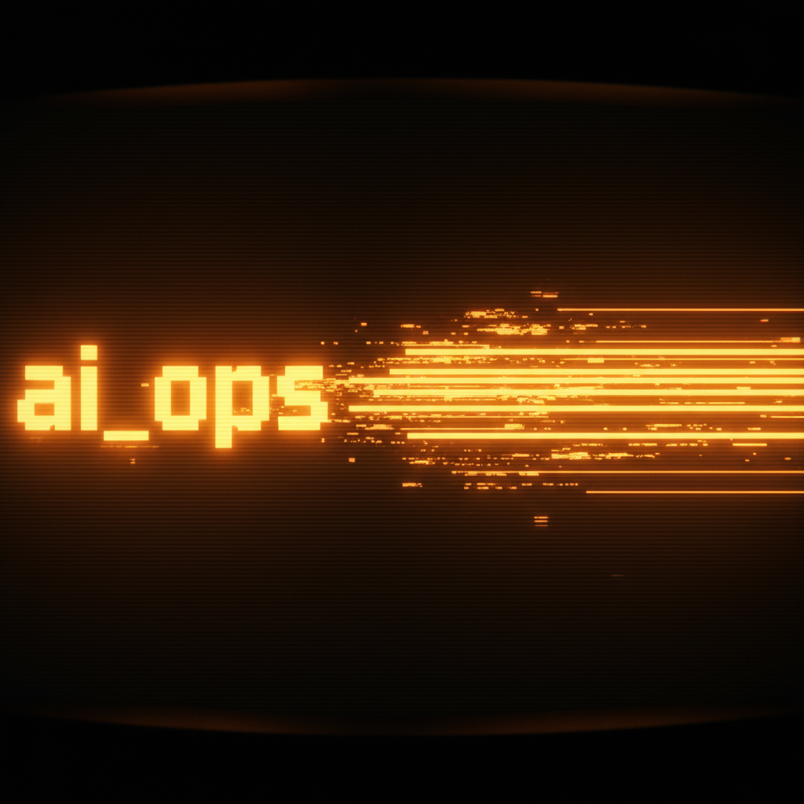
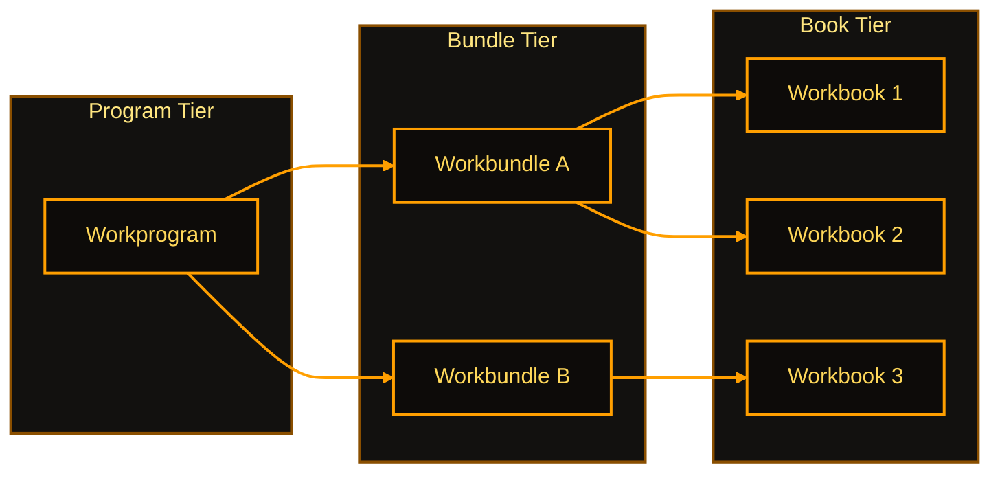
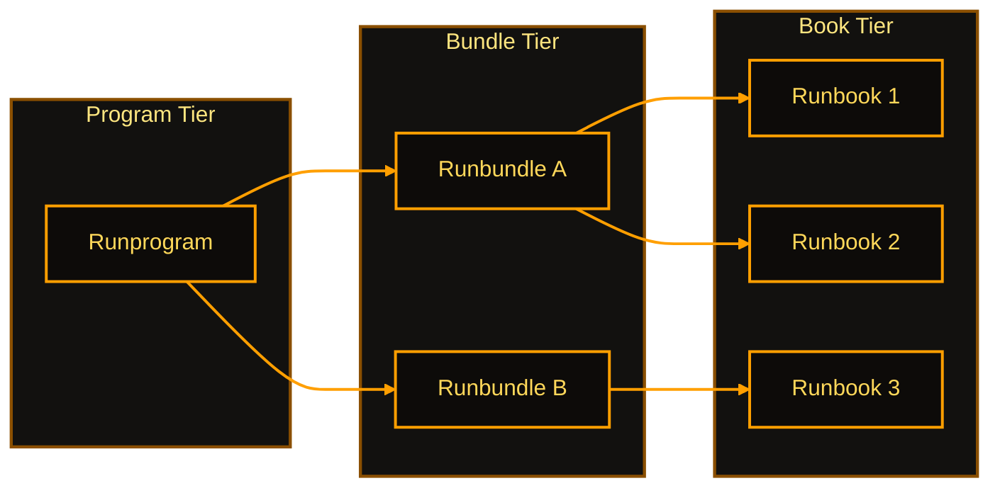
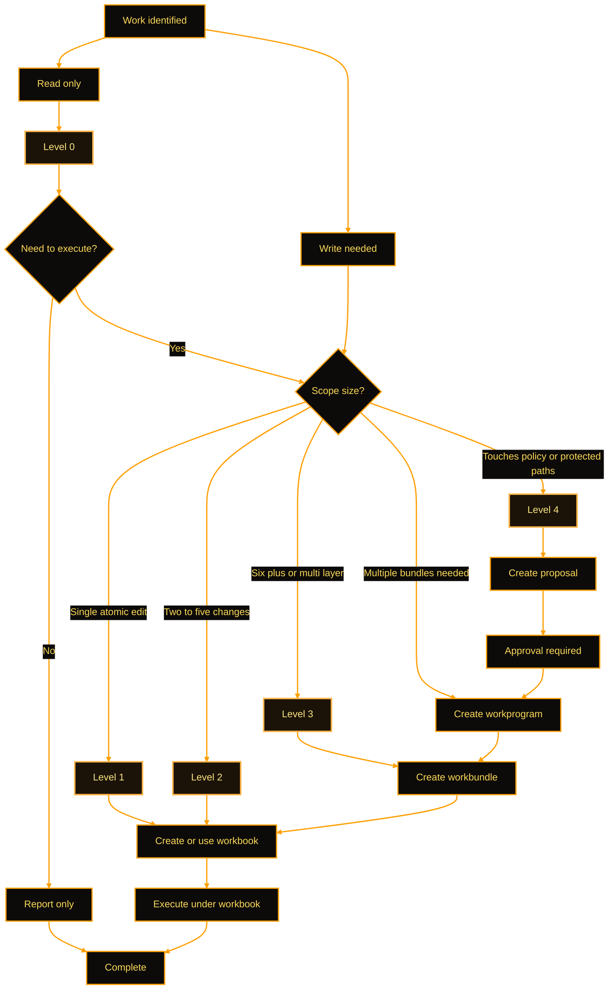
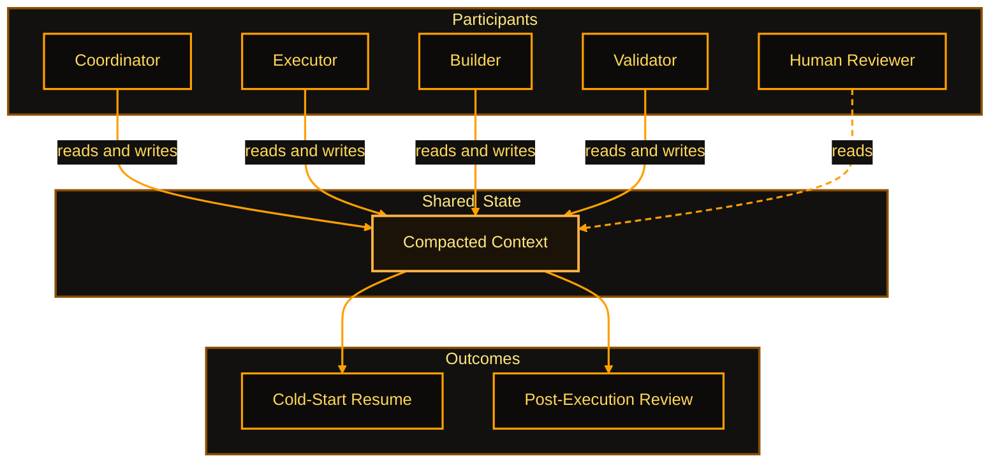

<!-- markdownlint-disable MD013 MD025 -->



# HUMANS - Start Here

ai_ops helps you work with AI agents safely and efficiently, without needing to
memorize governance internals.

---

## Core Concepts

A 2-minute orientation for new contributors.

**What is ai_ops?** A governance layer for AI agents and developer workflows.
It defines rules, workflows, and execution patterns so agents work safely and
consistently across sessions.

**Primary deployment -- governing external repos:** ai_ops lives in its own
repository. Your project repos are the *work repos*. When an agent runs
`/work` in a project repo, ai_ops governs that session: work artifacts are
created in the project repo's sandbox, validation runs against the project
repo's linter config, and git operations apply to the project repo. ai_ops
stays clean. One ai_ops install can govern multiple project repos. You can
also run ai_ops directly in its own repo to author governance rules -- this is
"direct mode." See [Governed Mode](#governed-mode-other-repos) for setup details.

**Five active directories:**

- `00_Admin/` -- Rules, guides, specs, runbooks, configs
- `01_Resources/` -- Templates and shared references
- `02_Modules/` -- Reusable capabilities and agent profiles
- `90_Sandbox/` -- Active work artifacts (gitignored; emerges from `/work`)
- `99_Trash/` -- Staged deletions (gitignored; emerges from `/closeout`)

`90_Sandbox/` and `99_Trash/` are not shipped in the repo. They appear
locally when you first run `/work` or `/closeout`. A fresh clone will not
have them -- that is expected.

**Authority levels (0-4):** 0 = read-only; 1 = operational (pre-authorized);
2 = single-file bounded; 3 = multi-file additive; 4 = structural/policy
(requires explicit approval before execution).

See [Authority Levels](#authority-levels) below for the full reference and flow diagram.

**Work hierarchy:** A *workbook* tracks one scoped task. A *workbundle*
groups a workbook with companion artifacts and may contain multiple workbooks
over time. A *workprogram* coordinates multiple workbundles in sequence.

See [Work Family Artifact Hierarchy](#work-family-artifact-hierarchy) and
[Run Family Artifact Hierarchy](#run-family-artifact-hierarchy) below.

**Agents and subagents:** Your *primary agent* is the AI assistant you type
commands to. In a standard run, that one agent handles everything -- planning,
executing, validating -- cycling through roles internally. In a *multi-agent run*,
the primary agent acts as Coordinator and spawns *subagents*, each assigned a
specific role (Executor, Builder, Validator). You interact directly only with the
primary agent; subagents are orchestrated in the background. Most day-to-day
ai_ops use is single-agent. Multi-agent runs are configured explicitly via
workbook `role_assignments` and crew setup.

**Key entry points:** `/work` to start, `/work_status` for a status check,
`AGENTS.md` for agent rules, `CONTRIBUTING.md` for authority guidelines.

## Axes At A Glance

Two axis groups drive ai_ops decisions:

- Organizing axes: `Intent -> Commitment -> Execution -> Verification` (+ Meta governance)
- Quality axes: `Clarity`, `Thrift`, `Context`, `Governance`

### Quality Axes Reference

Every artifact and operation is evaluated against four quality axes.
These serve as review dimensions for governance, not independent measures.

| Axis | Purpose | Interpretation | Scope | Quick-Scan Check |
| --- | --- | --- | --- | --- |
| **Clarity** | Cold-start readability | No inference required; inputs/steps/outputs explicit | Local (individual artifacts) | Can a new reader follow without external context? |
| **Thrift** | Efficient required outcome | Minimum cost to achieve result; includes execution burden, read hops, and retracing | Local + Global | Is each element necessary? Are there avoidable bounces? |
| **Context** | Reliable resumption/handoff | Work restarts from files; handoff state explicit | Global (task chain) | Can a different agent resume from artifacts alone? |
| **Governance** | Authority and gate discipline | Authority boundaries explicit, traced, and enforced | Global (scope crossing) | Are decision gates in the right place? Is authority clear? |

> **Thrift is not minimalism.** Thrift is efficiency -- the minimum cost to achieve the required
> outcome. In ai_ops, cost includes execution burden: avoidable read hops, retracing, and
> other internal cycle burden that slow cold-start execution or review.

### Quality Checklist (Pre-Completion)

Before reporting work complete, verify all four axes:

- [ ] **Clarity Pass:** A low-context reader can follow inputs, steps, and outputs without inference
- [ ] **Thrift Pass:** No bloat introduced; each element belongs in this artifact; no avoidable bounces
- [ ] **Context Check:** Compacted context updated; handoff is clear for cold-start resumption
- [ ] **Governance Check:** Authority level respected; scope not exceeded; gates in right order

## Work Family Artifact Hierarchy

Programs contain bundles. Bundles contain books. Support attaches to the tier it serves.



### Work Family Support Artifacts

| Tier | Support Artifacts |
| --- | --- |
| Program | Program README |
| Bundle | Bundle README, Outputs folder |
| Book | Compacted context, Scratchpad, Evidence pointers |

### Conditional Work Artifacts

- **Threshold Check -> Work Proposal -> downstream execution lane**: Activates
  when scope exceeds threshold or touches Level 4 governance surfaces. The
  proposal must be approved before downstream execution artifacts are created.
- **Execution Spine** (optional): Attaches at bundle level when sequential tracking is needed across books.

## Run Family Artifact Hierarchy

Programs contain bundles. Bundles contain books. Support and verification artifacts attach to
the tier they serve.



### Run Family Support Artifacts

| Tier | Support Artifacts |
| --- | --- |
| Program | Program README |
| Bundle | Bundle README, Companion refs |
| Book | Pipeline (optional), Tools and scripts, Contracts, Validators, Log pointers |

### Work vs Run Family

- Workbooks are frozen commitment artifacts; runbooks are reusable SOP references.
- Workbundles are run-scoped; runbundles are reusable reference containers.
- Verification artifacts (Contracts, Validators, Logs) attach at the book tier where execution happens.

## Authority Levels

Authority is explicit and gated. Five levels define what artifacts are created
and what approvals are required.

### Authority Levels Reference

| Level | Typical Scope | Commitment Artifacts Introduced |
| --- | --- | --- |
| 0 | read, analyze, report | none (may recommend workbook) |
| 1 | single atomic edit, pre-authorized | none or existing workbook |
| 2 | two to five related changes, single scope | workbook (recommended) |
| 3 | six plus changes or multi-layer | workbook plus bundle |
| 4 | policy, spec, architecture | proposal plus downstream workbook(s) |

### Work Artifact Structure

Commitment artifacts nest from program down to bundle down to book.
Authority level determines which structure is required.

- Level 2 -> workbook minimum
- Level 3 -> workbundle (workbook + bundle container)
- Level 4 -> workprogram (proposal + downstream workbooks)

### Authority Flow



### Safe Default Rule

If you are unsure of authority level, treat it as Level 3 and ask.
Better to over-gate than under-gate.

## What Artifacts Get Created (Typical)

When you run `/work`, agents usually update one or more of these:

- active workbook in `90_Sandbox/ai_workbooks/`
- workbundle README and compacted context
- scratchpad notes for in-session decisions and follow-ups
- review artifacts (for example `/crosscheck` outputs)

Exact files vary by scope and authority level, but changes should always point
to explicit artifact paths.

## Context Management

Compacted Context is the single shared run state for all participants. It lives as a repo
artifact -- in the workbundle README or workbook body -- not in any agent's memory. Every
participant reads from and writes to the same artifact, ensuring full transparency,
enabling cold-start resumption and post-execution review without requiring chat history.

### Shared Access



### Storage Locations

| Level | Location | Notes |
| --- | --- | --- |
| Book level | Workbook body (standalone run) | Use when no bundle coordinates the run |
| Bundle level | Workbundle README.md | Shared across all books in the bundle |
| Local only | .ai_ops/local/work_state.yaml (gitignored) | Machine-local; never committed; not a shared artifact |

### Update Cadence

Update compacted context at every:

1. Role handoff (Coordinator to Executor, Executor to Validator, etc.)
2. Phase completion (end of each workbook phase)
3. Scope change or new dependency discovered
4. Validation result (pass/fail finding requiring action)

## Mini Glossary

- **Workbook**: execution artifact for scoped, tracked work.
- **Workbundle**: folder that groups a workbook with companion artifacts; may contain multiple workbooks over time.
- **Workprogram**: multi-workbook coordination container (pipeline-level orchestration file family).
- **Runbook**: reusable operational procedure.
- **Runbundle**: folder that groups runbook execution artifacts.
- **Runprogram**: coordinated set of runbooks.

---

## Quick Start

How to confirm setup worked in 2 minutes:

1. **Clone** the repo into your working directory.
2. **Generate the manifest.** Setup scripts handle this automatically (Paths A and B).
   Manual path only:

   ```sh
   python 00_Admin/scripts/generate_workflow_exports.py
   ```

   Run once on first clone and whenever workflows are added or renamed.
3. **Run the setup script** for your agent from `.ai_ops/setup/`:
   - Claude Code: `bash .ai_ops/setup/setup_claude_skills.sh` (or `.bat` on Windows)
   - Codex: `bash .ai_ops/setup/setup_codex_skills.sh`
   - GitHub Copilot: use `.github/copilot-instructions.md`; on supported
     surfaces, `setup_claude_skills.*` also installs compatible project skills
     into `.claude/skills/`
   - See `.ai_ops/setup/README.md` for Cursor, Gemini, and other tools.
4. **Open a new conversation** with your agent and type `/work`.
5. The agent bootstraps, orients itself, and is ready to assist.

If `/work` is not recognized, use Path C: tell the agent to follow
`ai_ops/.ai_ops/workflows/work.md` directly. If the agent seems confused
after setup, run `/bootstrap` to reload context.

## First Session (5 minutes)

### 1) Pick a setup path

You have three valid setup paths:

- **A. Ask the agent (recommended):** "Run `/ai_ops_setup`."
  - The setup flow should confirm:
    - active surface (`codex_cli`, `claude_code`, `github_copilot`, `cursor`, `gemini_cli`, `other`)
    - installation target (`skills`, `commands`, `both`, `none`)
    - for `github_copilot`, use repo instructions plus `skills` or `none`;
      `commands` is not a valid ai_ops install target on that surface
- **B. Manual setup:** run the appropriate setup script from `ai_ops/.ai_ops/setup/`
  and use `ai_ops/.ai_ops/setup/README.md` for tool-specific instructions.
- **C. No install:** skip setup and invoke workflows directly (example:
  "follow `ai_ops/.ai_ops/workflows/work.md`").

Note: depending on tool surface, these commands are often installed as
**skills/wrappers** that dispatch to the same workflow files.

After setup, run `/customize` to declare your available models and preferred
reasoning level, then use `/profiles` if you want model-family behavior tuning.

### 2) Start working

Run `/work` and describe what you want to achieve. The agent should establish
context and choose the correct execution path.

### 3) Checkpoint or finish

- Use `/work_savepoint` to checkpoint without closeout.
- Use `/closeout` when done. Closeout behavior can vary by environment and
  authority scope, but should follow validation + status sync before completion.

### Install mechanics

Directory role split:

- `.ai_ops/` = canonical workflow source and setup/export surfaces
- `.ai_ops/local/` = machine-local config/profile/setup state (never committed)
- `.agents/` = Codex installed skills (workspace-root runtime artifact;
  gitignored -- generated by `setup_codex_skills.sh --workspace`)
- `.claude/` = Claude Code installed skills (workspace-root runtime artifact;
  gitignored -- generated by `setup_claude_skills.sh --workspace`; repo-root
  `.claude/` is not required and is no longer enforced by export drift checks;
  supported GitHub Copilot surfaces can also read project skills from here)
- GitHub Copilot uses `.github/copilot-instructions.md` for repo instructions;
  supported surfaces can also read project skills from `.claude/skills/` or
  `.github/skills/`. ai_ops currently uses `setup_claude_skills.*` for the
  `.claude/skills/` lane.

Install scope options are surface-dependent:

- `--workspace` (recommended): available on the Codex and Claude skill
  installers; installs to workspace root
  (`<workspace_root>/.agents/skills/`, `<workspace_root>/.claude/skills/`);
  workflow pointer resolves to `ai_ops/.ai_ops/workflows/`
- `--repo`: available on the Codex and Claude skill installers; installs
  inside the ai_ops repo tree (optional; not required for export drift checks)
- `--user`: currently supported by the Codex skill installers; installs to the
  user home directory (`$HOME/.agents/skills/`)
- GitHub Copilot uses tracked repo instructions plus project-skill folders;
  ai_ops does not currently provide a separate `--user` installer lane for
  Copilot

## Agent Profiles and Customization

ai_ops agents are configurable. Two commands set up your team's preferences
before you start working:

### `/customize` -- declare your models and reasoning defaults

Run once after setup (or when your environment changes):

- **Available models:** Tell the agent which AI models you have access to.
  This prevents it from selecting a model you cannot use.
- **Default reasoning level:** Set whether the agent defaults to fast/bounded
  reasoning (Level 1-2) or deeper deliberation (Level 3). Most teams use
  Level 2 as default with Level 3 reserved for governance work.

Settings are saved to `.ai_ops/local/config.yaml` (gitignored -- machine-local).

### `/profiles` -- tune agent behavioral posture

Profiles configure how your **primary agent** approaches work. Your primary agent is
the AI you interact with directly -- `/profiles` changes its behavioral style before
a session starts.

**Default behavior:** Without a named profile, your agent runs in its default
out-of-box posture: balanced, moderately conservative, and role-adaptive based
on the current task. This is sufficient for most work.

**Subagent profiles are different.** When the Coordinator spawns subagents in a
multi-agent run, each subagent's role and behavior are governed by its definition
file in `plugins/ai-ops-governance/agents/` and the `role_assignments` frontmatter
in the active workbook -- not via `/profiles`. Those six agent definition files are
generated artifacts managed by `/profiles`; do not hand-edit them. Rider personality
is less visible to you when applied to subagents; the working-style differences
primarily surface through your primary agent.

Each named profile wires three components:
a **rider archetype** (behavioral personality), a **role assignment** (which ai_ops
execution role this profile fills), and **parameter settings** for autonomy,
conservatism, initiative, and deference (each 0-100).

#### Rider archetypes

Riders define how an agent approaches work, independent of what task it is doing.

| Rider | Behavioral character | Strengths |
| --- | --- | --- |
| **logike** | Methodical, structured | Planning, scoping, tradeoff analysis -- slows down to get it right |
| **forge** | Action-oriented, delivery-focused | Execution, building, shipping -- moves fast under clear scope |
| **anchor** | Conservative, gate-enforcing | Review, correctness, holding the line -- thorough before approving |
| **scout** | Curious, exploratory | Discovery, research, surface coverage -- follows threads broadly |

#### Profile catalog

| Profile | Rider | Role | Best for |
| --- | --- | --- | --- |
| `ai-ops-planner` | logike | Coordinator | Scoping and planning sessions |
| `ai-ops-executor` | forge | Executor, Builder | Implementation and build tasks |
| `ai-ops-reviewer` | anchor | Validator | Crosschecks and structured review |
| `ai-ops-researcher` | scout | Coordinator (research phase) | Discovery and exploration |
| `ai-ops-closer` | forge | Executor | Closeout and finalization workflows |
| `ai-ops-linter` | anchor | Validator | Lint and validation automation (report-only) |

The Role column uses canonical ai_ops roles: Coordinator, Executor, Builder, Validator.
`ai-ops-executor` covers both Executor and Builder depending on task. `ai-ops-closer`
and `ai-ops-linter` are specialized Executor and Validator presets for specific workflows.

Run `/profiles` to view, edit, or regenerate profile contracts. Profiles are durable
across sessions once set -- you do not need to re-run on every session.

## Command Reference

### Core loop

| Command | Use it when | What it does |
| --- | --- | --- |
| `/work` | Starting or resuming work | Establishes context and execution path |
| `/work_status` | Need current state | Summarizes active work and blockers |
| `/work_savepoint` | Stopping mid-task | Records checkpoint without closeout |
| `/closeout` | Work is complete | Runs validation and closeout workflow |

### Review and cleanup

| Command | Use it when | What it does |
| --- | --- | --- |
| `/crosscheck` | Need review feedback | Runs structured review workflow |
| `/health` | Repo seems inconsistent | Runs report-only health analysis |
| `/lint` | Need validation-only output | Runs configured validators/linters without fixes |
| `/harvest` | Artifacts need cleanup | Consolidates and prunes work artifacts |

### Utilities

| Command | Use it when | What it does |
| --- | --- | --- |
| `/scratchpad` | Need structured notes | Creates or updates scratchpad notes |
| `/customize` | Preferences need updates | Applies configuration workflow |
| `/profiles` | Agent behavior contracts need updates | Edits rider/crew profile source and regenerates outputs |
| `/bootstrap` | Context feels wrong | Re-reads context and readiness inputs |

If wrappers are unavailable, ask the agent to run the workflow file directly
from `ai_ops/.ai_ops/workflows/`.

---

## Governed Mode (other repos)

ai_ops can govern execution in another repo while keeping governance logic in
this repo:

- Work artifacts are created in the target repo sandbox.
- Validation runs against the target repo command path.
- Git operations apply to the target repo unless explicitly scoped otherwise.

## Troubleshooting

- **Agent behavior seems off:** run `/bootstrap`, then rerun `/work`.
- **Commands not recognized:** use manual setup (Path B) or direct workflow
  invocation (Path C).
- **Work context seems stale:** run `/work_status` or `/bootstrap` to reload context.
- **Unexpected or oversized changes:** ask for a workbook-based rollback and
  authority recheck before additional edits.
- **Need to undo changes:** prefer non-destructive rollback options (for
  example, `git revert`) unless you explicitly choose destructive reset.

## Learning More

| Topic | Where to look |
| --- | --- |
| Human overview | `ai_ops/README.md` |
| Agent rules and behavior | `ai_ops/AGENTS.md` |
| Authority and approvals | `ai_ops/CONTRIBUTING.md` |
| Workflow source of truth | `ai_ops/.ai_ops/workflows/` |
| Setup scripts and tool notes | `ai_ops/.ai_ops/setup/README.md` |
| Release-quality gate | `ai_ops/00_Admin/runbooks/rb_release_quality_gate_01.md` |
| Guides catalog | `ai_ops/00_Admin/guides/README.md` |

## Quick Reference Appendix

### Command roles

| Command group | Default role pattern |
| --- | --- |
| `/work`, `/work_status`, `/work_savepoint` | Coordinator (context-first) |
| `/crosscheck`, `/health` | Validator (report-only by default) |
| `/closeout` | Executor (execution + completion workflow) |
| `/harvest` | Coordinator + Executor |

### Role Reference

Role sequence flows left to right. Coordinator repeats at each cycle boundary.
Builder is invoked as needed -- not every run requires a dedicated Builder step.


| Role | When Active | Primary Duties | Default Model Level | Notes |
| --- | --- | --- | --- | --- |
| Coordinator | Start, between phases, at end | Plan scope, select workflows, manage handoffs, approve gates | Level 2 | Level 3 for L4 or architectural decisions |
| Executor | Per work step | Execute current step, maintain logs, flag blockers | Level 1 or 2 | Primary execution lane. Level 1 for bounded tasks; Level 2 when judgment required |
| Builder | When tooling needed | Write tools, implement automation, update configs | Level 2 | Spawned as needed; may be skipped in execution-only runs |
| Validator | After each phase | Review outputs against contracts, issue pass/fail verdict | Level 2 | Level 3 for Elevated Crosscheck |

**Agent topology:**

- **Single agent:** one agent cycles through all roles in sequence.
- **Multi-agent:** Coordinator spawns a dedicated subagent per role and orchestrates handoffs.

### Supported tool surfaces

- Claude Code (`.claude/skills/` or `.claude/commands/`)
- Codex (`.agents/skills/` default; `.codex/skills/` on-demand compatibility mirror)
- Cursor (wrapper support varies by environment and command format)
- Gemini CLI and Google Antigravity (integration path depends on current Google tooling surface)
- GitHub Copilot (`.github/copilot-instructions.md`; project skills via `.claude/skills/` or `.github/skills/` on supported surfaces)

## For Developers

See [00_Admin/guides/authoring/](00_Admin/guides/authoring/) for validator rules, runbook and
workflow authoring guidance, and AI-operations process documentation.

## Design Tests

When proposing a new artifact or process, run eight named design tests. All must pass.

Tests cover: axis mapping (one axis per artifact), cold-start readability, resumption
after failure, explicit gate placement, thrift (cycle burden), single canonical source
(adapter pattern), review independence, and portability across tool surfaces.

Full reference, pass criteria, and anti-patterns:
[Design Tests Guide](00_Admin/guides/ai_operations/guide_design_tests.md)

Run all eight tests on new artifact types, significant process changes, and
cross-layer governance changes. Any test failure -> redesign required before adoption.
